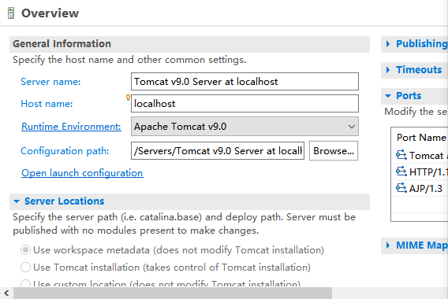
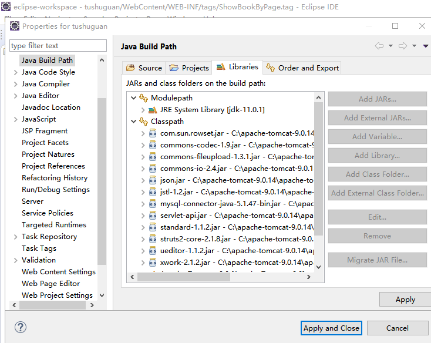
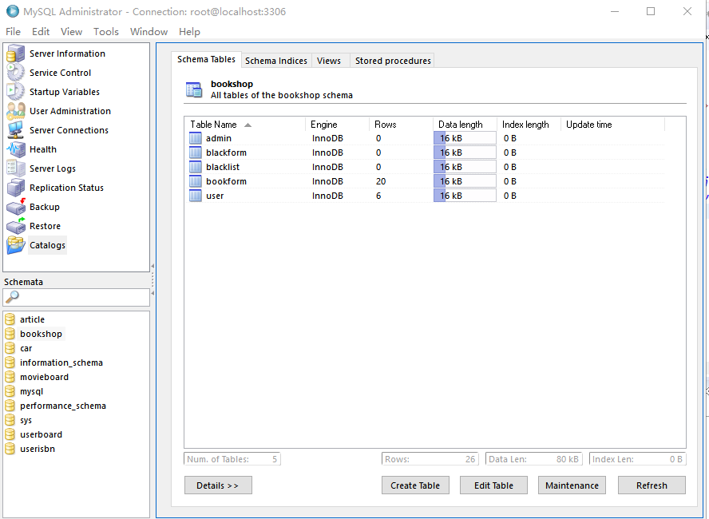

# 爱影网影评系统 设计说明书

## 部署说明

### 1、Tomcat服务器
    
目前，对于采用JSP开发的应用程序中，程序员们往往将由Apache和Sun公司共同开发而成的一个免费的开源JSP引擎Tomcat作为首选的Web应用服务器。由于它具有轻量级的特点，而本课题设计的“爱影网”影评系统只是一个小型系统，并未拥有很多的并发访问用户，因此将它选为应用服务器。传统的CGI会为每个用户启动一个进程，而Tomcat服务器在多个用户请求同一个JSP页面时，会为每个用户启动一个线程，这些线程的任务是执行常驻于内存的字节码文件来响应用户的请求。同时Tomcat服务器会管理这些线程，为了保证每个线程都有机会执行用户所需的字节码文件，Tomcat服务器会将CPU的使用权在各线程之间快速切换

### 2、Eclipse开发平台

一个好的集成化开发环境会使得一个项目的开发工作事半功倍，而Eclipse作为一款Java程序开发框架而备受青睐，它具有开放源代码、可无限扩展的特点。作为拥有优良体系结构的Eclipse，它能够以插件的形式将各种开发工具无缝地拼接到一个统一的平台上。这让开发人员能够轻易地对各种应用系统进行编码、编译、调试、运行。

### 3、MySQL数据库服务器

MySQL数据库服务器是多用户、跨平台、关系型、完全网络化、分布式、方便管理、安全可靠性强、运行速度快、标准化、多线程、快速的。同时它的体系结构属于客户机/服务器体系结构。基于它的这些特点，“爱影网”影评系统将选择它作为数据库服务器。在“爱影网”影评系统中，我们通过在Tag文件中引入DriverManager类，并调用getConnection（）方法来创建一个连接对象，在指定了正确的URI后就可以让“爱影网”影评系统与MySQL数据库建立连接。

