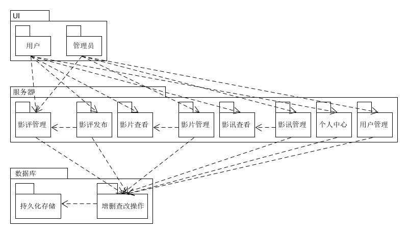
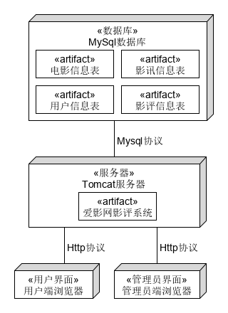

# 爱影网影评系统 设计说明书

## 架构设计

### 1、架构问题
    
可靠性：系统要明确区分管理员与用户权限，管理员、用户对系统的每一项内容进行操作要明确定位。

### 2.解决方案说明

#### 1）解决方案概要

使用jsp中的session定位当前操作。JSP利用servlet提供的HttpSession接口来识别一个用户，存储这个用户的所有访问信息。
```js
<%@ page session="false" %>
```

#### 2）因素

保证操作的准确性

#### 3）解决方案

- public Object getAttribute(String name)
返回session对象中与指定名称绑定的对象，如果不存在则返回null
- public Enumeration getAttributeNames()
返回session对象中所有的对象名称
- public long getCreationTime()
返回session对象被创建的时间， 以毫秒为单位，从1970年1月1号凌晨开始算起
- public String getId()
返回session对象的ID
- public long getLastAccessedTime()
返回客户端最后访问的时间，以毫秒为单位，从1970年1月1号凌晨开始算起
- public int getMaxInactiveInterval()
返回最大时间间隔，以秒为单位，servlet 容器将会在这段时间内保持会话打开
- public void invalidate()
将session无效化，解绑任何与该session绑定的对象
- public boolean isNew()
返回是否为一个新的客户端，或者客户端是否拒绝加入session
- public void removeAttribute(String name)
移除session中指定名称的对象
- public void setAttribute(String name, Object value) 
使用指定的名称和值来产生一个对象并绑定到session中
- public void setMaxInactiveInterval(int interval)
用来指定时间，以秒为单位，servlet容器将会在这段时间内保持会话有效

#### 4）动机

如果不能准确识别用户和用户操作，系统将会陷入混乱。

### 3、逻辑视图



### 4、物理视图


