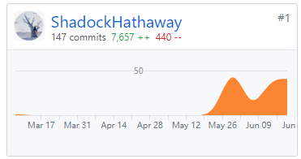

### 自我总结

协助完成了系统需求分析、竞品调研，协助完成了系统需求规格说明书（包括用例图、活动图、领域模型、状态模型、功能模型、补充需求）以及设计说明书（包括界面设计、数据库设计、接口API设计、架构设计、用例设计）
。独立完成了系统开发（学习JSP开发技术、配置搭建开发环境、学习使用Eclipse开发平台）。

### PSP 2.1 统计表

|  | Personal Software Process Stages | Time(%) |
| ------------ | ------------------------------------------------------ | ------- |
| **Planning** | 计划  | **5%**  |
| estimate | 预估任务时间 | 5%      |
| **Development** | 开发   | **85%** |
| analysis | 需求分析 | 20%     |
| design spec | 生成设计文档  | 10%     |
| estimate | 设计复审（与前端团队成员审核设计文档） | 5%      |
| coding standard | 代码规范     | 5%     |
| design | 具体设计，包括绘制 UI，设计架构等  | 5%      |
| coding | 具体编码  | 25%     |
| code review | 代码复审   | 5%     |
| test | 测试（修改代码）  | 10%     |
| Report | 报告  | **10%**     |
| test report | 测试报告 | 3%     |
| size measurement | 计算工作量  | 1%     |
| postmortem & process improvement plan | 每次迭代结束后写总结文档，并提出改进计划 | 6%     |

### Git统计报告

### 工作清单

- 协助完成系统竞品调研，与时光网、豆瓣网进行优劣势分析；
- Tomcat服务器的配置；
- Eclipse开发环境的部署；
- API设计、UI设计、数据库设计、架构设计、用例设计；
- 系统功能开发；
- 协助完成需求分析文档、绘制用例图、活动图、领域模型、状态模型、功能模型。

### 博客清单

[JSP学习笔记](https://blog.csdn.net/QingJiuYou/article/details/93414838)
[影评系统的机遇与挑战](https://blog.csdn.net/QingJiuYou/article/details/93423779)
